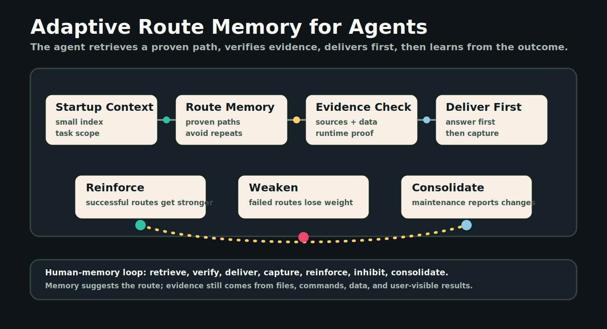
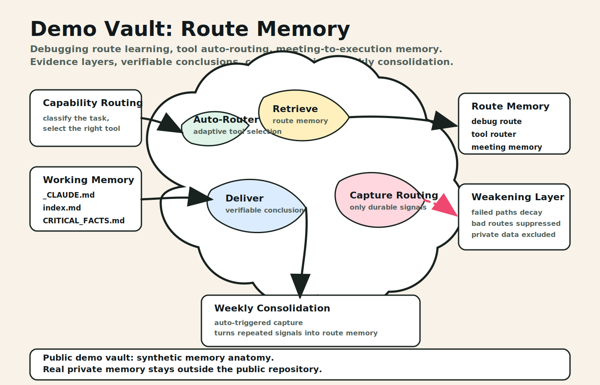

# Codex Second Brain OS

一個給 Codex / AI agent 使用的 Obsidian 第二大腦操作系統。

它不是要公開私人筆記，而是公開一套可重複使用的方法：讓 agent 先讀上下文、選對工具、交付結果，再把值得保留的知識寫回 vault，形成可追蹤、可驗證、可逐步變聰明的工作流。

## Project Scope

這個 public package 只放兩個部分：

| 區塊 | 內容 | 不包含 |
|---|---|---|
| `system/` | 可公開的 agent 操作規則、capture routing、memory graph、weekly consolidation workflow | 私人日記、真實公司資料、帳號、憑證、正式資料庫內容 |
| `demo-vault/` | 匿名範例 vault，用假資料展示任務如何被捕捉、查詢、保存、路由 | 真實客戶、ERP 單號、財務、人名、會議逐字稿 |

## Visual Overview





## Why This Exists

一般筆記系統只回答「資料放哪裡」。這個專案解決的是另一個問題：

> 當 AI agent 有很多工具、插件、skill、connector、文件、資料庫與歷史記憶時，它要怎麼在每次任務中選對路徑，並且把經驗留給下一次？

所以設計重點不是漂亮分類，而是把 agent 工作變成一條可驗證的閉環：

1. **Startup context**：任務開始先讀 `_CLAUDE.md`、`index.md`、`Home.md`、`CRITICAL_FACTS.md`，避免 agent 從零猜測。
2. **Capability routing**：根據任務類型選擇合適能力，例如文件轉 Markdown、資料查詢、簡報流程、程式碼索引、瀏覽器或 app connector。
3. **Delivery first**：先完成使用者可用的結果，不讓整理筆記、保存記憶或規則升級擋在前面。
4. **Evidence boundary**：分清楚「記憶提示」、「文件證據」、「程式碼證據」、「資料庫證據」、「實際執行驗證」。
5. **Capture routing**：任務完成後，只把值得重用的事保存，例如決策、查詢口徑、錯誤訊息、程式路徑、欄位意義、驗證結果。
6. **Memory graph**：把成功/失敗路線變成 edge，下次遇到類似任務可先走高可信路徑，避開已知失敗模式。
7. **Weekly consolidation**：定期整理 append-only captures、更新 index、檢查孤兒筆記與過期規則，但不破壞原始證據。

## Practical Use

### Example 1: Screenshot or Document to Markdown

使用者丟一張表格截圖或文件，agent 會：

1. 先判斷這是 document/image extraction 任務；
2. 優先使用 MarkItDown 或 OCR/目視校對；
3. 交付可用 Markdown 表格；
4. 若內容有長期價值，再保存來源、轉檔路徑與結果摘要。

### Example 2: ERP / System Investigation

使用者問「這個欄位影響哪裡」時，agent 不直接憑印象回答，而是：

1. 從既有 index 或 memory graph 找到可能的程式/資料表線索；
2. 再查 source、schema、SQL 或 runtime 證據；
3. 回答時把證據層分開；
4. 保存可重用的欄位、程式、錯誤碼、查詢口徑。

### Example 3: Tool-Routing Friction

如果某個任務反覆走錯工具，系統會把失敗 signature 記錄下來。下次同樣情境出現時，agent 會先檢查 attempt guard，避免一直重複同一條錯路。

## Advantages

- **Less re-discovery**：常用規則、欄位、工具路徑、驗證口徑會留下來。
- **Better agent judgment**：不是硬背指令，而是根據任務類型做 capability routing。
- **Public-safe by design**：公開的是方法與假資料，不公開私人 vault 內容。
- **Evidence-first**：重要結論保留來源與驗證邊界，避免把記憶當事實。
- **Delivery-first**：正常對話先交付結果，保存與整理在後面做。
- **Works with plain Markdown**：核心資料是 Obsidian/Markdown，不綁死單一平台。

## Repository Layout

```text
.
├── README.md
├── assets/
│   ├── homepage-system-flow.svg
│   └── homepage-demo-vault.svg
├── system/
│   ├── README.md
│   ├── AGENTS.example.md
│   ├── capture-routing.md
│   ├── memory-graph.md
│   ├── weekly-consolidation.md
│   └── .codex/commands/README.md
└── demo-vault/
    ├── README.md
    ├── _CLAUDE.md
    ├── index.md
    ├── Home.md
    ├── CRITICAL_FACTS.md
    ├── Knowledge/Examples/
    ├── Dev Logs/
    └── Logs/
```

## What To Copy Into Your Own Vault

Start small:

1. Copy `system/AGENTS.example.md` into your own agent instructions and remove anything irrelevant.
2. Copy the `demo-vault/` structure only as a reference, not as your real data.
3. Add your own `_CLAUDE.md`, `index.md`, and `CRITICAL_FACTS.md`.
4. Use capture routing only after the main answer is delivered.
5. Keep private data in a private repo or local vault. Public repo should contain method, not raw life/work memory.

## Safety Rule

Do not publish raw private vault content. Public examples should be redacted, synthetic, or intentionally generic.

